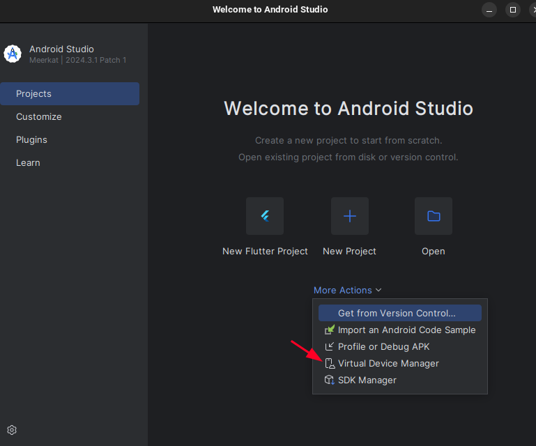
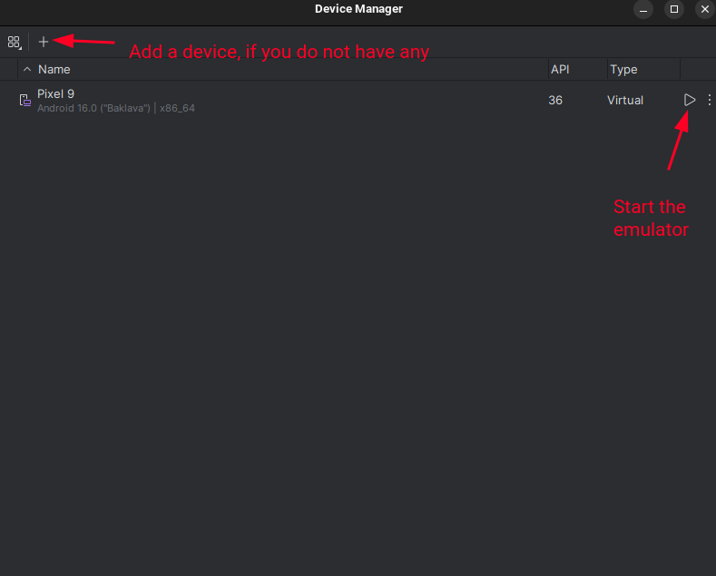
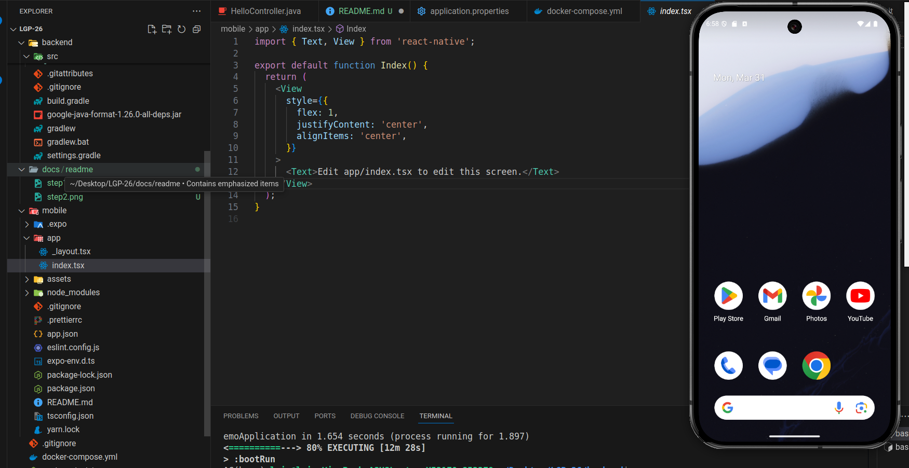

# Finalyze - Product Installation and Maintenance Packages (PIMP)

## How to contribute?

When implementing a new feature, please follow these steps:
1. Create a new branch from `develop` with the name of the feature you are going to implement.
2. Implement the feature.
3. Push the branch to the remote repository.
4. Create a pull request to the `develop` branch.
5. Wait for the pull request to be reviewed and merged.


## Index
- [How to contribute?](#how-to-contribute)
- [How to run?](#how-to-run)
  - [Prerequisites](#prerequisites)
  - [Run the backend](#1-run-the-backend)
  - [Run the frontend](#2-run-the-frontend)
- [PgAdmin - How to access?](#pgadmin---how-to-access)


## How to run?

### Prerequisites
- Java >= 17
- [Node.js/NPM](https://docs.npmjs.com/downloading-and-installing-node-js-and-npm) >= 10.0
- [Docker](https://docs.docker.com/get-started/get-docker/)
- [Android Studio](https://developer.android.com/studio) (for running the app in an emulator)
- [VSCode](https://code.visualstudio.com/) (optional, but recommended)

We recommend you to use `VSCode` as your IDE, so that you can write code for both the frontend and backend in the same place. 

In this case we are just using `Android Studio` to run the emulator. If you wish to use other IDE (e.g. IntelliJ for the backend), you can do so, but we do not provide guidance in this README for that.

First of all, you need to clone this repository to your local machine. You can do this by running the following command in your terminal:

```bash
git clone git@github.com:FEUP-LGP-2025/LGP-26.git
```

After this, in the root folder of the project you must run the following command to expose the database and the PgAdmin:

```bash
docker-compose build
docker-compose up
```

### 1. Run the backend
In the root folder of the project, navigate to the `backend` folder and run the following command:

```bash
./gradlew bootRun
```

This will start the Spring Boot application on port 8080. You can access the API at [http://localhost:8080/api](http://localhost:8080/api).

For demonstration purpose, we have created a `HelloController.java` that prints `This endpoint is working!` when you access the endpoint [http://localhost:8080/api/hello](http://localhost:8080/api/hello). You can test this endpoint using the browser or other tools like Postman or curl.

### 2. Run the frontend

In order to run the app in a emulator, you must have Android Studio installed. You can download it from [here](https://developer.android.com/studio).

After installing, create an emulator by following these steps:




You must see this screen:


Now that the emulator is running, you can run the app. In the root folder of the project, navigate to the `mobile` folder and run the following command:

```bash
npm install
```
This will install all the dependencies needed to run the app. After this, you can run the app by running the following command:

```bash
npm run android
```
This will start the React Native app on the emulator.

## PgAdmin - How to access?

Sometimes, while working with the database, you may want to check the data that is being stored in it. For this, we have created a PgAdmin instance that you can access by going to [http://localhost:5050](http://localhost:5050). You can log in with the following credentials:

````
admin@example.com
admin_password
````

To establish a connection to the database, ensure you have the database running (that should be the case if Docker is running). Then, follow these steps:

1. Click on "Add New Server" in dashboard.
2. Give a name you want in the `General` tab.
3. In the `Connection` tab, fill in the following details:
   - Host: `db`
   - Port: `5432`
   - Maintenance database: `mydb`
   - Username: `postgres`
   - Password: `postgres`
4. Click on "Save" to create the connection.

TO ENABLE THE FRONTEND TO CONNECT TO THE BACKEND, YOU NEED A .ENV FILE IN THE ROOT OF THE MOBILE FOLDER THAT CONTAINS THE FOLLOWING LINE (WHILE RUNNIGN AN ANDROID EMULATOR):

```
EXPO_PUBLIC_API_URL="http://10.0.2.2:8080/api"
```

The connection should now be established, and you can view the database tables and data.

